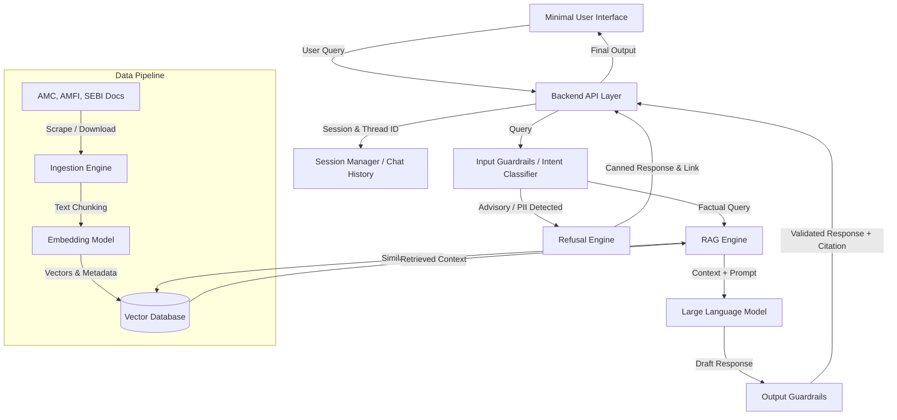
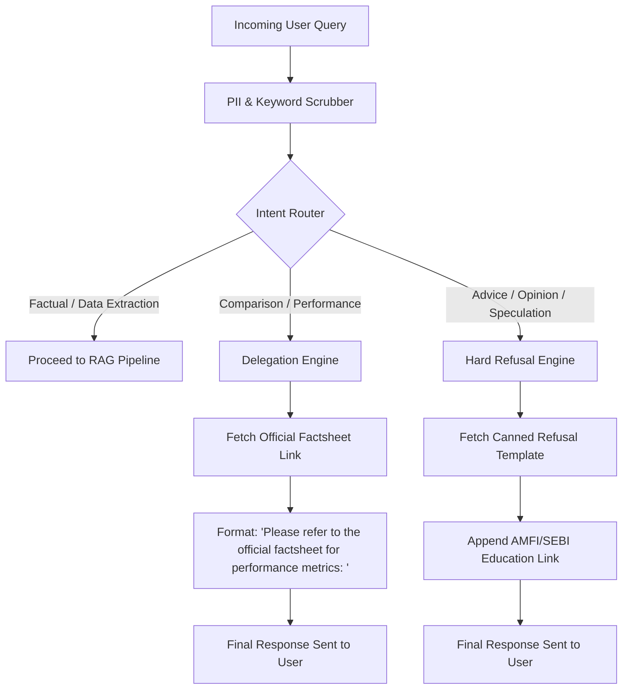

# Architecture Document: Mutual Fund FAQ Assistant (Facts-Only Q&A)

## 1. System Overview
The Mutual Fund FAQ Assistant is a lightweight Retrieval-Augmented Generation (RAG)-based system designed to answer factual, verifiable queries regarding mutual fund schemes. It strictly references a curated corpus of official public documents (AMC, AMFI, SEBI) and ensures compliance by aggressively refusing advisory queries and withholding any investment recommendations.

## 2. High-Level Architecture Diagram
*(Conceptual Representation)*

## 3. Core Components

### 3.1 Detailed Architecture: Data Ingestion & Storage Pipeline
The Data Ingestion pipeline is the foundation of the facts-only RAG mechanism. It ensures that the LLM is restricted to verified, pre-approved documents and web pages.

#### 3.1.1 Target Source Links
The corpus is seeded exclusively from the following verified mutual fund links covering a diverse portfolio across two primary AMCs:

**HDFC Mutual Funds:**
- [HDFC Mid-Cap Opportunities Fund](https://groww.in/mutual-funds/hdfc-mid-cap-fund-direct-growth)
- [HDFC Flexi Cap Fund](https://groww.in/mutual-funds/hdfc-equity-fund-direct-growth)
- [HDFC Focused 30 Fund](https://groww.in/mutual-funds/hdfc-focused-fund-direct-growth)
- [HDFC ELSS Tax Saver Fund](https://groww.in/mutual-funds/hdfc-elss-tax-saver-fund-direct-plan-growth)
- [HDFC Top 100 Fund (Large Cap)](https://groww.in/mutual-funds/hdfc-large-cap-fund-direct-growth)

**Nippon India Mutual Funds:**
- [Nippon India Large Cap Fund](https://groww.in/mutual-funds/nippon-india-large-cap-fund-direct-growth)
- [Nippon India Growth Fund (Mid Cap)](https://groww.in/mutual-funds/nippon-india-growth-mid-cap-fund-direct-growth)
- [Nippon India Multi Cap Fund](https://groww.in/mutual-funds/nippon-india-multi-cap-fund-direct-growth)
- [Nippon India Power & Infra Fund](https://groww.in/mutual-funds/nippon-india-power-infra-fund-direct-growth)

#### 3.1.2 Automated Scheduling & Scraping Service
- **CRON Scheduler (GitHub Actions)**: A dedicated daily orchestrator utilizing **GitHub Actions Scheduled Workflows** (`on: schedule`) is configured to run **every day at exactly 9:15 AM IST** (using the cron syntax `45 3 * * *`). This triggers the ingestion pipeline within an automated runner, guaranteeing that the system fetches the latest NAVs and daily updated fund facts without requiring a persistent background server.
- **Scraping Service**: Triggered by the GitHub Action, this autonomous python script iterates through the verified source URLs. It utilizes robust HTTP fetching or headless browsing (e.g., Playwright, BeautifulSoup) to dynamically scrape the latest HTML payloads from the targeted Groww links.
- **Targeted Data Elements**: Extracts structural text such as FAQs, fund overviews, NAVs, expense ratios, riskometers, and holding summaries directly from the fetched web pages. *(Note: No PDFs will be downloaded or processed for this corpus; only the explicitly provided direct web links are used).*

#### 3.1.3 Data Processing & Chunking Strategy
- **Text Extraction**: Parses the raw HTML into clean, readable text, stripping away navigation bars, footers, and redundant UI elements.
- **Semantic Chunking**: Splits the extracted web text into logical blocks (e.g., 500-800 tokens) with an overlap window (e.g., 100 tokens) to ensure context isn't lost across chunk boundaries.
- **Metadata Tagging**: It is absolutely critical that every text chunk is appended with rigid metadata before vectorization:
  - `source_url`: The exact link where the data was located.
  - `fund_name`: Specific fund associated with the text.
  - `document_type`: Webpage, SID, Factsheet, etc.
  - `last_updated_date`: Extracted timestamp required for the assistant's mandatory footer.

#### 3.1.4 Embedding & Vectorization
- **Embedding Generation**: Text chunks pass through a robust embedding model (`BAAI/bge-small-en-v1.5`) capable of capturing financial semantic nuances.
- **Vector Database**: Vectors and their associated metadata are pushed to a **Remote ChromaDB** instance (via trychroma.com) over HTTP. The database is structured to support metadata-filtered Cosine Similarity searches (e.g., searching specifically within chunks tagged `fund_name = 'HDFC Mid-Cap Opportunities Fund'`).

### 3.2 Input Guardrails & Intent Classification
Before any retrieval happens, queries must pass through a strict filter:
- **PII Scrubbing**: Detects and outright blocks queries containing PAN, Aadhaar, phone numbers, or account numbers.
- **Intent Classifier**: Analyzes the query to determine if it is:
  - *Factual* (e.g., "What is the exit load?", "What is the benchmark?"): Proceed to Retrieval.
  - *Advisory / Evaluative* (e.g., "Should I invest?", "Which is better?"): Routes immediately to the Refusal Engine.

### 3.3 Detailed Architecture: Retrieval-Augmented Generation (RAG) Engine
The exact mechanism that fetches truth and safely constructs the user response. It is specifically optimized for high precision and strictly limits LLM hallucination.

#### 3.3.1 Query Processing & Embedding
- **Query Formulation**: The raw user query (e.g., "What is the expense ratio for HDFC Flexi Cap?") is cleaned and optionally expanded with synonymous financial terms to improve retrieval.
- **Query Embedding**: The processed query is vectorized using the identical embedding model employed during Data Ingestion (`BAAI/bge-small-en-v1.5`) to ensure vectors exist in the exact same mathematical space.

#### 3.3.2 Vector Search & Retrieval (Retriever)
- **Top-K Semantic Search**: Queries the Vector Database utilizing Cosine Similarity to fetch the Top-K (e.g., top 3 to 5) most semantically similar text chunks.
- **Metadata Filtering**: If the query implicitly or explicitly mentions a specific fund (e.g., "Nippon India Large Cap"), the retriever applies a deterministic pre-filter on the `fund_name` metadata tag to dramatically narrow the search space before calculating vector similarity.
- **Re-ranking (Optional but Recommended)**: The retrieved chunks run through a lightweight Cross-Encoder model to accurately re-rank the top results, ensuring only highly precise textual snippets are supplied to the language model.

#### 3.3.3 Injection & Strict System Prompting
Once relevant context chunks are secured, they are bundled together with the core system prompt. The prompt is heavily constrained to ensure compliance:
- **System Instructions**:
  - *Constraint 1*: "You are a financial information assistant. You must answer relying ONLY on the provided context."
  - *Constraint 2*: "If the exact answer is not found in the context, you must reply: 'I do not have factual information on that topic in my current sources.'"
  - *Constraint 3*: "Do not formulate any opinions, advice, or future speculations."
  - *Constraint 4*: "The final response must not exceed 3 sentences."
  - *Constraint 5*: "You must include exactly ONE source web link based exclusively on the provided metadata."
  - *Constraint 6*: "You must append the exact string: 'Last updated from sources: <date>' to the bottom of your response."

#### 3.3.4 Response Generation (LLM Synthesis)
- **Model Selection**: A fast, highly instructable generative model (e.g., GPT-4o-mini, Claude 3.5 Haiku, or Llama 3 8B Instruct) is utilized. It must prioritize instruction-following formatting strictly above creative output.
- **Synthesis Engine**: Synthesizes the extracted chunks into human-readable text, ensuring proper grammatical flow while explicitly abiding by the length, citation, and factual constraints provided.

### 3.4 Output Guardrails (Post-Processing)
- Verifies that the LLM output does not exceed the 3-sentence limitation.
- Ensures a valid citation is present.
- Double-checks that no comparative/advisory language leaked into the response.

### 3.5 Backend API Layer (Multi-Thread Management)
- **Session/Thread Manager**: Maintains multiple, independent conversation threads to support concurrent user sessions. Stores chat context in memory or a lightweight database (e.g., Redis or SQLite) without tying it to any user PII.
- **API Endpoints**: Exposes REST/GraphQL endpoints for the frontend to create threads, send messages, and fetch history.

### 3.6 User Interface (Minimal)
- **Initial State**: Displays a welcome message, three clickable example questions, and a prominent disclaimer: *"Facts-only. No investment advice."*
- **Chat Window**: Renders user queries, system responses (with citations correctly formatted), and relevant AMFI/SEBI educational links when a query is refused.

### 3.7 Detailed Architecture: Refusal Handling (Point 3)
The Refusal Handling mechanism is a specialized, high-priority subsystem designed to strictly enforce the "Facts-Only" constraint. It acts as an absolute barrier against providing investment advice, opinions, or performance conclusions.

#### 3.7.1 Architecture Flow for Refusal

#### 3.7.2 Intent Router & Scrubber
- **Heuristic Keyword Scrubber**: A deterministic regex-based filter evaluating the query against a blacklist of terms (e.g., "should I invest", "better than", "recommend", "advice", "predict").
- **LLM-based Intent Classifier**: A lightweight classification model that assesses the semantic meaning of the query to catch implicit advisory requests that might bypass simple keyword matches.

#### 3.7.3 Refusal Categories & Response Generation
- **Category 1: Explicit Advice / Opinions**
  - *Trigger*: Queries asking for recommendations, evaluations, or forecasting.
  - *Action*: Hard refusal.
  - *Response Engine*: Outputs a guaranteed, static template: *"I am designed to provide only factual information. I cannot provide investment advice or recommendations. You can learn more about mutual fund investments at the [AMFI Investor Corner](url)."*
- **Category 2: Performance & Comparison Requests**
  - *Trigger*: Queries asking to calculate returns or comparing which fund is performing better.
  - *Action*: Delegation.
  - *Response Engine*: Refuses to synthesize a comparison or calculate numbers, but retrieves and delegates to the official factsheet link where the user can find verified performance metrics directly.

#### 3.7.4 Audit & Compliance Logging
- Every refusal event triggers an asynchronous audit event. The log captures the sanitized query, the triggered refusal category, and the timestamp. This provides an audit trail for compliance officers to monitor system boundaries and tune the intent classifiers without recording user PII.

## 4. Security & Compliance Constraints
- **Zero PII**: Architecture explicitly omits authentication layers or persistent user profiles containing emails/phones. Input guardrails trap transient PII.
- **Restricted Corpus**: The system does not possess general web access. It relies completely on the bounded target index created during the Data Ingestion phase.
- **Refusal Mechanism**: Unambiguously standardized refusal responses are employed for ambiguous or distinctly opinion-based prompts to mitigate liability.
