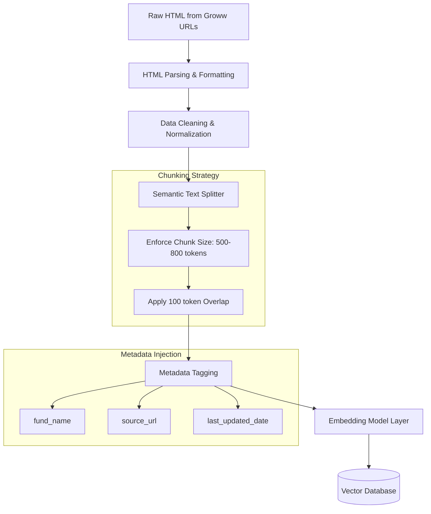

# Detailed Architecture: Chunking & Embedding Pipeline

This document serves as a deep dive into the specific data transformation layer of the Mutual Fund FAQ Assistant, specifically focusing on how unstructured web text is processed, chunked, and vectorized before being stored.

## 1. Pipeline Overview
Once the HTML payloads are fetched via the GitHub Actions Scraping Service, the raw data must be mathematically transformed so the LLM can understand it. This process bridges the gap between human-readable text and the Vector Database.



## 2. Text Formatting & Normalization
Before chunking occurs, the data is pre-processed to remove web artifact noise:
- **HTML Stripping**: BeautifulSoup removes all `<nav>`, `<footer>`, `<script>`, and `<style>` tags.
- **Table Flattening**: Mutual fund data heavily relies on tables (e.g., Returns, Holding structures). Tables are parsed and flattened into linear, pseudo-markdown formats (e.g., `"Return: 1yr = 12.5% | 3yr = 18.2%"`) to ensure semantic retention.
- **Whitespace Normalization**: Removes excessive line breaks to keep vector space dense.

## 3. Semantic Chunking Strategy
Because LLMs have strict context length limits and retrieve information best in concise fragments, the data is split into multiple "chunks".

### 3.1 Chunking Parameters
- **Chunk Size (500 to 800 Tokens)**: Ensures that each chunk is large enough to contain complete thoughts (like an entire FAQ answer or a full fund summary) but small enough to prevent token bloat during RAG retrieval.
- **Token Overlap (100 Tokens)**: A sliding window strategy. The last 100 tokens of Chunk A will also be the first 100 tokens of Chunk B. This prevents catastrophic context loss if a sentence or paragraph boundary is artificially cut exactly down the middle.

### 3.2 Splitting Heuristics (Recursive Character Splitting)
1. The text splitter prioritizes breaking text at hard natural demarcations (`\n\n` or Paragraph bounds).
2. If a paragraph is longer than 800 tokens, it falls back to sentence bounds (`. `).
3. If a sentence is impossibly long, it falls back to raw space breaks (` `).

## 4. Metadata Injection
Every generated chunk is wrapped tightly with essential metadata. This transforms raw vectors into highly filterable objects.
An example chunk structure looks like this:
```json
{
  "chunk_id": "b7a8-4f2c-91e8...",
  "text": "The HDFC Mid-Cap Opportunities Fund carries an expense ratio of 0.85% for direct plans...",
  "metadata": {
    "fund_name": "HDFC Mid-Cap Opportunities Fund",
    "amc": "HDFC",
    "source_url": "https://groww.in/mutual-funds/hdfc-mid-cap-fund-direct-growth",
    "document_type": "Webpage Content",
    "last_updated_date": "2024-05-18",
    "chunk_index": 4
  }
}
```

## 5. Embedding Vectorization
To perform similarity search, the text chunk must be converted into a numerical array (a vector).

### 5.1 Embedding Model Selection
- Model Used: **`BAAI/bge-small-en-v1.5`** (Open Source).
- **Justification**: This model provides state-of-the-art English semantic embeddings while remaining highly compact (384 dimensions). It is incredibly fast, operates entirely locally (avoiding API charges), and easily possesses enough reasoning power to analyze the tightly bounded corpus consisting of the 9 target mutual fund entities.

### 5.2 Dimensionality & Metric
- The resulting vector is an array of exactly 384 floating-point numbers.
- **Distance Metric**: The system uses **Cosine Similarity** to calculate the distance between the user's embedded query and the embedded chunks. This measures the angle between vectors, making it highly effective for matching intent regardless of document length.

## 6. Vector Database Persistence
The final vectors and their JSON metadata payloads are pushed over HTTP to a **Remote ChromaDB** deployment (e.g., hosted on trychroma.com). This database is specifically optimized to perform K-Nearest Neighbor (KNN) or Approximate Nearest Neighbor (ANN) indexing over high-dimensional arrays rapidly in the cloud.
